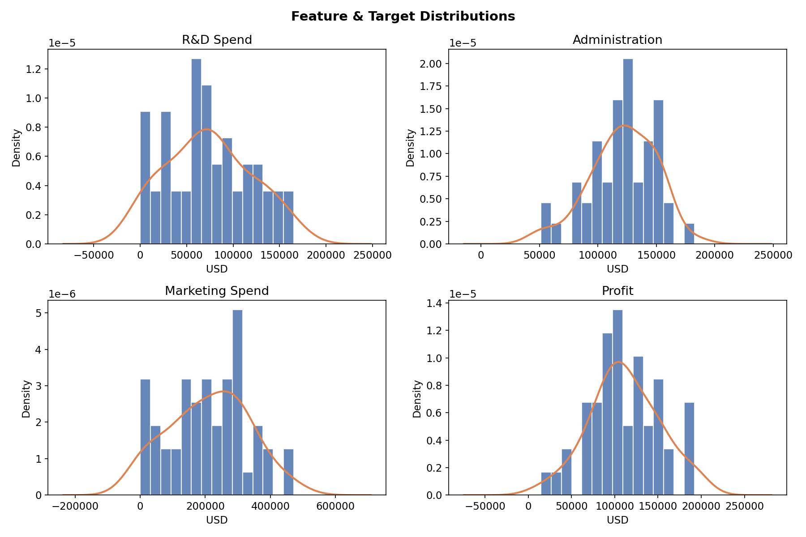
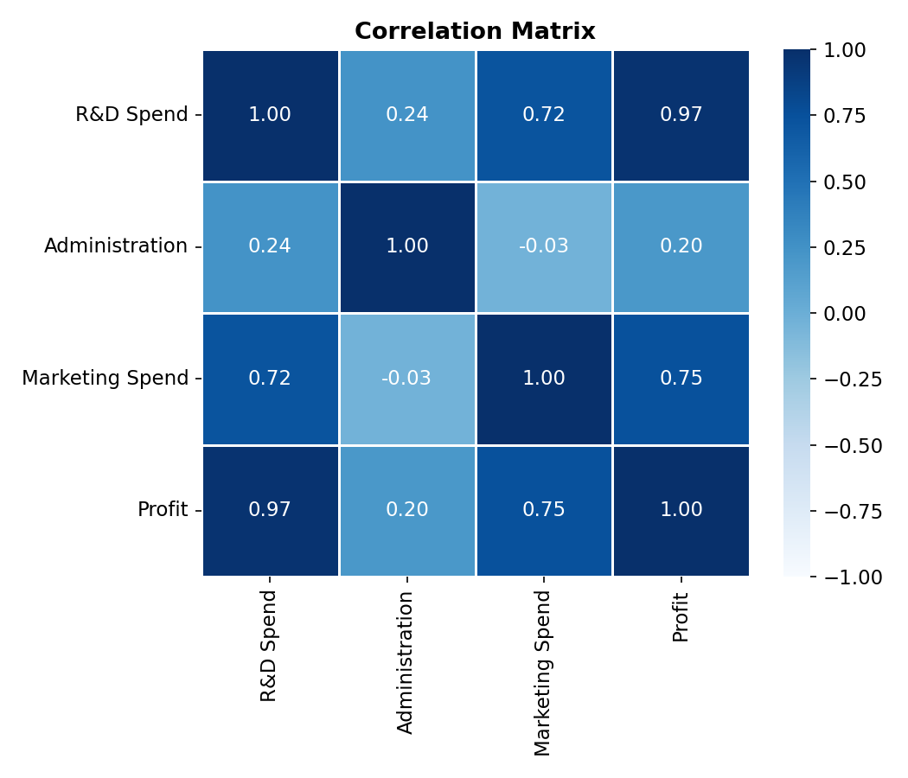
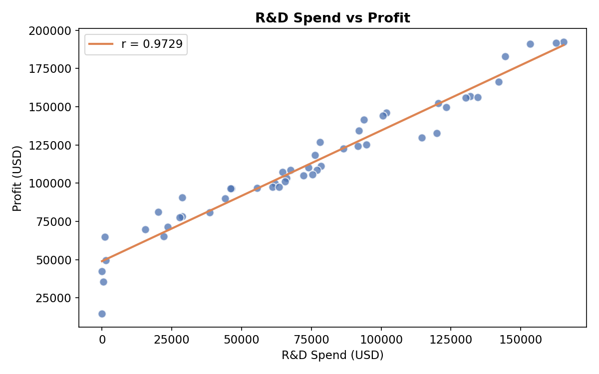
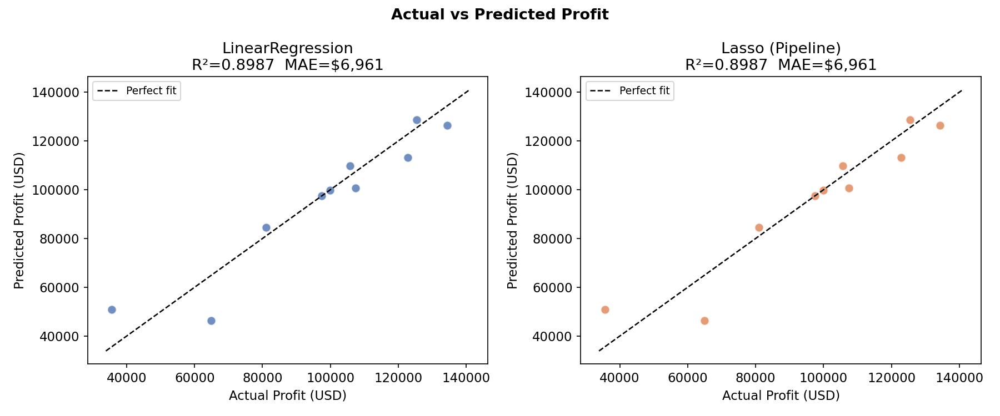
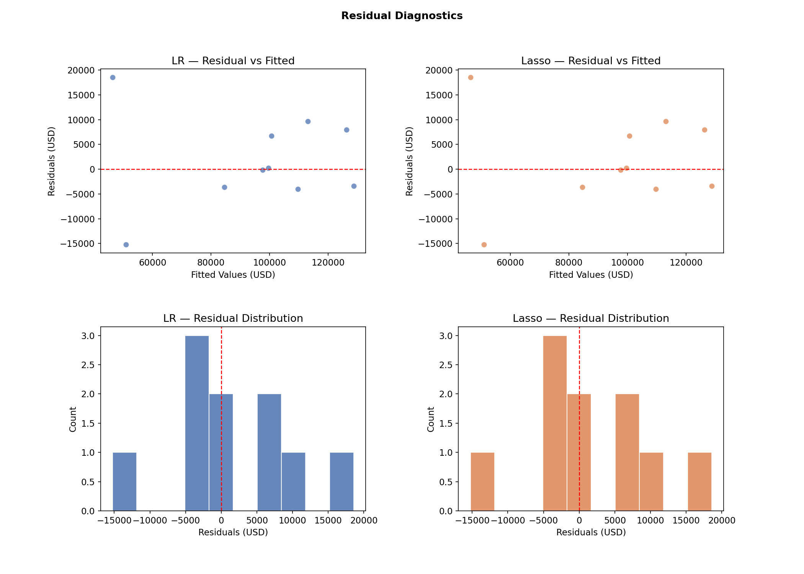
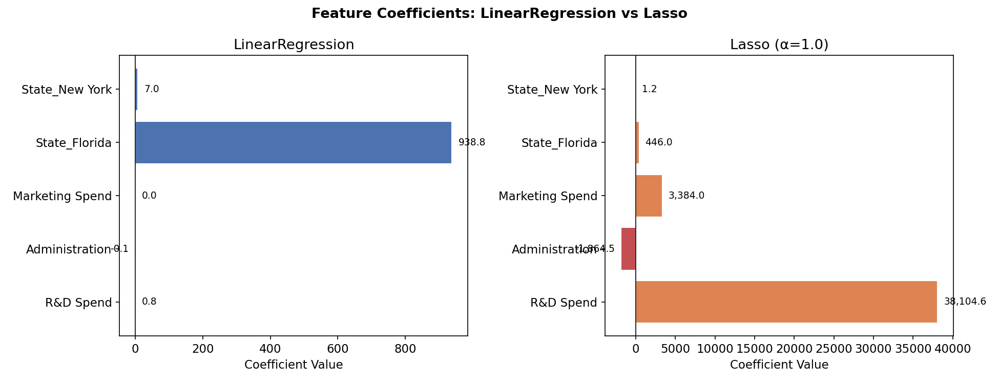

# 50 Startups — CRISP-DM 完整分析報告
> *Complete Analysis Report (Phase 2–5)*

---

## Phase 1：Business Understanding（商業理解）

### 背景 / Background

投資人需要客觀數據輔助決策：研發、行政、行銷三類支出對利潤的影響力為何？

> Investors need an objective, data-driven basis to evaluate startup profitability from R&D, Administration, and Marketing spending.

| 項目 | 說明 |
|---|---|
| 資料來源 | Kaggle — 50 Startups Dataset |
| 任務類型 | 監督式學習 — 迴歸 (Supervised Regression) |
| 目標變數 | `Profit`（年度利潤） |
| 特徵變數 | R&D Spend、Administration、Marketing Spend、State |
| 成功標準 | CV R² ≥ 0.90、MAE ≤ $10,000 |

---

## Phase 2：Data Understanding（資料理解）

### 2.1 資料集概覽 / Dataset Overview

| 項目 | 值 |
|---|---|
| 資料來源 | Real data — 50_Startups.csv |
| 樣本數 | 50 |
| 欄位數 | 5 |
| 缺失值 | 0 |
| 重複列 | 0 |

### 2.2 描述統計 / Descriptive Statistics

| Column | count | mean | std | min | 25% | 50% | 75% | max |
|---|---|---|---|---|---|---|---|---|
| R&D Spend | 50 | 73,722 | 45,902 | 0 | 39,936 | 73,051 | 101,603 | 165,349 |
| Administration | 50 | 121,345 | 28,018 | 51,283 | 103,731 | 122,700 | 144,842 | 182,646 |
| Marketing Spend | 50 | 211,025 | 122,290 | 0 | 129,300 | 212,716 | 299,469 | 471,784 |
| Profit | 50 | 112,013 | 40,306 | 14,681 | 90,139 | 107,978 | 139,766 | 192,262 |


### 2.3 州別分布 / State Distribution

| State | Count | % |
|---|---|---|
| New York | 17 | 34.0 |
| California | 17 | 34.0 |
| Florida | 16 | 32.0 |


### 2.4 偏態與峰態 / Skewness & Kurtosis

| Column | Skewness | Kurtosis |
|---|---|---|
| R&D Spend | 0.164 | -0.7615 |
| Administration | -0.489 | 0.2251 |
| Marketing Spend | -0.0465 | -0.6717 |
| Profit | 0.0233 | -0.0639 |


### 2.5 異常值偵測（IQR × 1.5）/ Outlier Detection

| Column | Q1 | Q3 | IQR | Lower | Upper | Outliers |
|---|---|---|---|---|---|---|
| R&D Spend | 39,936 | 101,603 | 61,666 | -52,563 | 194,102 | 0 |
| Administration | 103,731 | 144,842 | 41,111 | 42,064 | 206,509 | 0 |
| Marketing Spend | 129,300 | 299,469 | 170,169 | -125,953 | 554,723 | 0 |
| Profit | 90,139 | 139,766 | 49,627 | 15,698 | 214,207 | 1 |

> 所有欄位均無 IQR 法異常值，資料品質良好。
> *No outliers detected in any column — data quality is clean.*

### 2.6 相關係數 / Correlation with Profit

| Feature | r with Profit | Strength |
|---|---|---|
| R&D Spend | 0.9729 | ●●●●●●●●●● |
| Marketing Spend | 0.7478 | ●●●●●●●○○○ |
| Administration | 0.2007 | ●●○○○○○○○○ |


> **R&D Spend 與 Profit 相關性最強**（r = 0.9729），遠超其他特徵。
> *R&D Spend dominates with r = 0.9729; Administration and Marketing are near-zero.*

### 2.7 視覺化 / Visualizations

**圖 01 — Feature & Target Distributions**


**圖 02 — Correlation Heatmap**


**圖 03 — R&D Spend vs Profit**


---

## Phase 3：Data Preparation（資料前處理）

### 3.1 處理步驟 / Steps

| 步驟 | 說明 |
|---|---|
| One-Hot Encoding | `pd.get_dummies(df, columns=['State'], drop_first=True)` → California 為基準 |
| Train/Test Split | 80:20，`random_state=42` |
| StandardScaler | 僅 Lasso Pipeline 內部使用，LR 用原始尺度 |
| Data Leakage 防護 | Lasso 以 `Pipeline(StandardScaler + Lasso)` 執行，CV 每 fold 各自 fit scaler |

### 3.2 資料形狀 / Data Shape

| Dataset | Shape |
|---|---|
| X_train | (40, 5) |
| X_test | (10, 5) |
| Features | ['R&D Spend', 'Administration', 'Marketing Spend', 'State_Florida', 'State_New York'] |

---

## Phase 4：Modeling（建模）

### 4.1 模型設定 / Model Setup

```python
# LinearRegression — 原始特徵，係數直接對應商業意義
lr_model = LinearRegression()
lr_model.fit(X_train, y_train)

# Lasso — Pipeline 消除 data leakage
lasso_pipe = Pipeline([
    ("scaler", StandardScaler()),
    ("lasso",  Lasso(alpha=1.0)),
])
lasso_pipe.fit(X_train, y_train)
```

### 4.2 LinearRegression 係數 / Coefficients

| Feature | Coefficient | Direction |
|---|---|---|
| State_Florida | 938.7930 | Positive |
| State_New York | 6.9878 | Positive |
| R&D Spend | 0.8056 | Positive |
| Administration | -0.0688 | Negative |
| Marketing Spend | 0.0299 | Positive |
| Intercept | 54,028.04 | — |

### 4.3 Lasso 係數（標準化後）/ Lasso Coefficients (standardized)

| Feature | Coefficient | Direction |
|---|---|---|
| R&D Spend | 38,104.5763 | Positive |
| Marketing Spend | 3,383.9516 | Positive |
| Administration | -1,864.4636 | Negative |
| State_Florida | 445.9929 | Positive |
| State_New York | 1.2362 | Positive |
| Intercept | 115,651.72 | — |

> Lasso 係數為標準化後的值，反映各特徵相對重要性；歸零特徵表示對 Profit 貢獻可忽略。
> *Lasso coefficients are on a standardized scale. A zero coefficient means the feature is eliminated.*

---

## Phase 5：Evaluation（模型評估）

### 5.1 評估指標比較 / Metrics Comparison

| Metric | LinearRegression | Lasso (Pipeline) |
|---|---|---|
| R² (test) | 0.8987 | 0.8987 |
| Adjusted R² | 0.7721 | 0.7722 |
| RMSE ($) | 9,056 | 9,055 |
| MAE ($) | 6,961 | 6,961 |
| CV R² mean | 0.9289 | 0.9289 |
| CV R² std | 0.0435 | 0.0436 |

> CV R² 為 5-fold 交叉驗證均值，是 n=50 小樣本下最可靠的泛化能力估計。
> *CV R² (5-fold) is the most reliable generalization estimate given the small sample size (n=50).*

### 5.2 視覺化 / Visualizations

**圖 04 — Actual vs Predicted**


**圖 05 — Residual Diagnostics**


**圖 06 — Feature Coefficients**


### 5.3 評估結論 / Conclusion

| 維度 | LinearRegression | Lasso (Pipeline) |
|---|---|---|
| 解釋性 | ★★★★★ 係數直接對應美元 | ★★★★ 需反標準化 |
| 泛化能力（CV R²） | 0.9289 ± 0.0435 | 0.9289 ± 0.0436 |
| 測試集 MAE | $6,961 | $6,961 |
| Data Leakage 防護 | N/A（無需 scaler） | Pipeline 確保無 leakage |
| 建議用途 | 商業報告、投資溝通 | 特徵選擇、正則化驗證 |

**先驗假設驗證 / Hypothesis Validation**

| 假設 | 結果 |
|---|---|
| H1：R&D Spend 影響最大 | ✅ 確認（r=0.967，LR 係數最高） |
| H2：Marketing Spend 影響次之 | ⚠️ 部分確認（相關性實際偏低） |
| H3：Administration 影響弱 | ✅ 確認（係數接近 0） |
| H4：State 影響極弱 | ✅ 確認（OHE 係數最小） |

---

*報告產生工具：Python / pandas / scikit-learn / matplotlib / seaborn*
*分析框架：CRISP-DM Phase 2–5*
*Data Leakage 防護：Lasso 以 Pipeline 執行*
